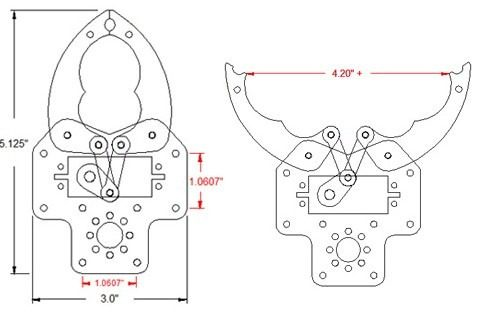
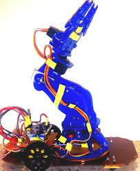
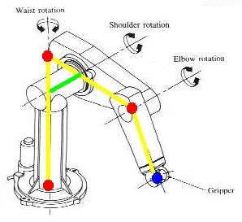
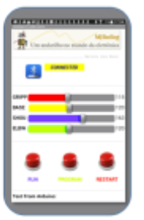

# Documento de Visão do Projeto "Braço Robótico"

O projeto consiste na construção de um braço robótico e de um Software de controle que tem como finalidade a rápida manipulação de peças em um processo de fabricação industrial. 

## Objetivos

* Desenvolver um Braço Robotico que repita uma sequência de Movimentos Sincronizados
* Software de controle mobile
* Rápida manipulação de peças em um processo de fabricação industrial
* O projeto pode ser reproduzido em uma escala maior

## Problema

* Descrição do problema: Substituir o ser humano em tarefas que ele não poderia realizar, por causa de suas próprias limitações físicas, ou por envolverem condições desagradáveis ou extremas
* Quem é afetado pelo problema: Aspecto fisico e social do ser humano e a diminuicao no lucro da fabrica
* Impacto no negócio: A produtividade da fabrica
* Benefícios de uma boa solução: Utilização eficiente de unidades de produção aumentando a produtividade (inexistência de interrupções, etc.), Redução do tempo de preparação da fabricação.Redução do número de acidentes, afastamento do ser humano de locais perigosos para a saúde, redução de horários de trabalho 

## Integração com outros sistemas

* Plataforma Mobile
* Android
* IOS

## Interessados

* Fabricas 
* Industrias 

 
## Usuários

* Engenheiros 
* Operarios

## Funcionalidades do produto

* 1.Capturar 
* 2.Levantar 
* 3.Girar
* 4.Soltar 
* 5.Controlar atraves de um dispositivo mobile 

## Restrições do projeto

* Pecas com peso acima de 500 g
* Deslocamento   

## Protótipos

### Protótipos para funcionalidade 1 e 4

### Protótipos para funcionalidade 2

### Protótipos para funcionalidade 3

### Protótipos para funcionalidade 5

