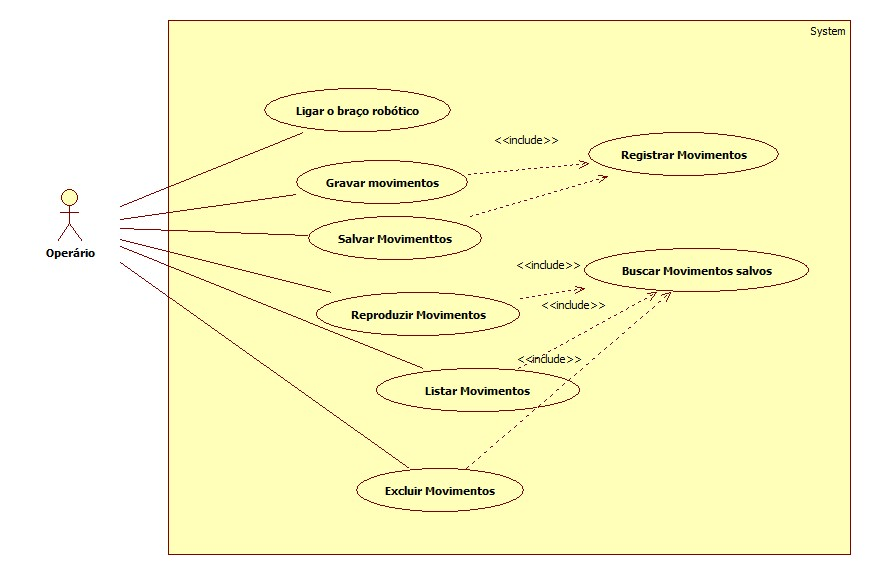

# Casos de uso

## 1. Diagrama de casos de uso

## 2. Especificação dos casos de uso

### 2.1. Caso de uso **Ligar o braço robótico**

| Campo          | Informação        |
|---|---|
| Identificador: | UC01              |
| Nome:          | Ligar o braço robótico |
| Atores:        | Operário               |
| Sumário:       | Liga o braço robótico  |

| Fluxo Principal |
|---|
| 1) O operário liga o braço robótico através de um aparelho mobile.  |
| 2) O operário seleciona a próxima ação.                |

| Fluxo Alternativo (2a): O aplicativo não consegue se conectar com o braço robótico. |
|---|
| 1) O aplicativo não consegue se conectar com o braço robótico. |
| 2) O operário reinicia o aplicativo . |
| 3) Volta ao passo (1) do fluxo principal. |

| Campo          | Informação        |
|---|---|
| Identificador: | UC02              |
| Nome:          | Gravar movimentos |
| Atores:        | Operário               |
| Sumário:       | Grava os movimentos desejados pelo operário  |

| Fluxo Principal |
|---|
| 1) O operário seleciona o modo de gravação.  |
| 2) O operário direciona os movimentos a serem salvos.                   |

| Fluxo Alternativo (2a): O aplicativo não consegue gravrar os movimentos  |
|---|
| 1) O aplicativo não consegue iniciar a gravação dos movimentos realizados pelo btraço robótico.|
| 2) O operário reinicia o aplicativo . |
| 3) Volta ao passo (1) do fluxo principal.|

| Campo          | Informação        |
|---|---|
| Identificador: | UC03          |
| Nome:          | Salvar os movimentos |
| Atores:        | Operário               |
| Sumário:       | Salva os movimentos gravados pelo operário  |

| Fluxo Principal |
|---|
| 1) O operário seleciona a opção de salvar  os movimentos  |
| 2) O operário encerra o mode gravação do braço robótico.                   |

| Fluxo Alternativo (2a): O aplicativo não consegue salvar os movimentos  |
|---|
| 1) O operário não consegue salvar os movimentos |
| 2) O aplicativo perde os movimentos gravados pelo operário |
| 3) Volta ao passo (1) do fluxo principal do caso de uso UC03 . |

| Campo          | Informação        |
|---|---|
| Identificador: | UC04         |
| Nome:          | Reproduzir Movimentos |
| Atores:        | Operário               |
| Sumário:       | Reproduz os movimentos salvos  |

| Fluxo Principal |
|---|
| 1) O operário seleciona qual movimento deseja reproduzir   |
| 2) O aplicativo se conecta com o braço robótico e reproduz os moviemntos                    |

| Fluxo Alternativo (2a): O aplicativo não consegue reproduzir os movimentos salvos  |
|---|
| 1) O aplicativo não consegue se conectar com o braço robótico. |
| 2) O operário reinicia o aplicativo . |
| 3) Volta ao passo (1) do fluxo principal. |

| Campo          | Informação        |
|---|---|
| Identificador: | UC05        |
| Nome:          | Listar Movimentos |
| Atores:        | Operário               |
| Sumário:       | Listar Movimentos salvos  |

| Fluxo Principal |
|---|
| 1) O operário seleciona listar todos os moviementos gravados no aplicativo   |
| 2) O aplicativo mostra todos os movimentos salvos                   |

| Fluxo Alternativo (2a): O aplicativo não consegue listar os movimentos salvos  |
|---|
| 1) O aplicativo não consegue listar os movimentos salvos. |
| 2) O operário reinicia o aplicativo . |
| 3) Volta ao passo (1) do fluxo principal. |

| Campo          | Informação        |
|---|---|
| Identificador: | UC06       |
| Nome:          | Buscar Movimentos |
| Atores:        | Operário               |
| Sumário:       | Buscar Movimentos salvos  |

| Fluxo Principal |
|---|
| 1) Após  o UCO5 estar finalizado, o operário busca o movimento desejado |
| 2) Operário escolhe o movimento desejado                 |

| Fluxo Alternativo (2a): O aplicativo não consegue buscar o movimento salvo  |
|---|
| 1) O aplicativo não consegue buscar  o movimento salvo. |
| 2) O operário reinicia o aplicativo . |
| 3) Volta ao passo (1) do fluxo principal  |

| Campo          | Informação        |
|---|---|
| Identificador: | UC06       |
| Nome:          | Excluir Movimentos |
| Atores:        | Operário               |
| Sumário:       | Excluir Movimentos salvos  |

| Fluxo Principal |
|---|
| 1) Após  o UCO5 estar finalizado, o operário busca o movimento desejado |
| 2) Operário escolhe o movimento a ser excluido              |
| 3) Movimento excluido com sucesso            |

| Fluxo Alternativo (2a): O aplicativo não consegue excluir o movimento salvo  |
|---|
| 1) O aplicativo não consegue excluir o movimento salvo. |
| 2) O operário reinicia o aplicativo . |
| 3) Volta ao passo (1) do fluxo principal  |
