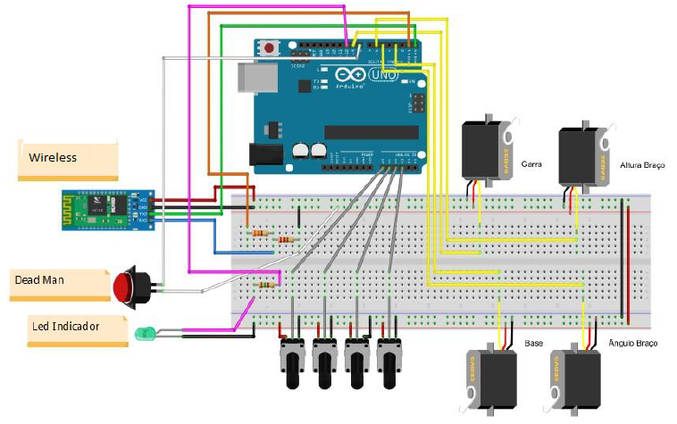

     
#   Projeto 
## Braço Robótico aplicado em Fábricas 

 O projeto consiste na construção de um braço robótico e de um Software de controle que tem como finalidade a rápida manipulação de peças em um processo de fabricação industrial.

## Descrição de Hardware 

### Lista de Materiais 

o	4 – Servos motores, modelo SG90;
o	4 – Potenciômetros 100 k;
o	1 – Botão push button N/A;
o	2 m – Cabo sem manga 8 vias;
o	1 – Fonte 5v 3A;
o	1 – Caixa Patola PB 114 TE
o	1 – Arduino Uno R3 ou compatível;
o	1 – Módulo bluetooth HC- 06;
o	4 – Knobs;
o	1 – Resistor 220R;
o	1 – Resistor 330R;
o	1 – Resistor 150R;
o	Fios Jumpers para Arduino;
o	Parafusos.
o	1 – Braço comercial em acrílico modelo ARM2;

 

## Plataforma de Desenvolvimento

o	IOS – Aplicativo Mobile 
o	C++ - Arduino 

### Desenho Tinkercad 
 
 
 

 ### Esquema eletrônico
 
 

 

